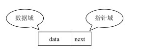
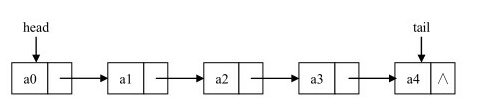
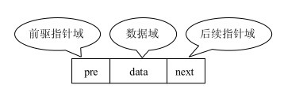
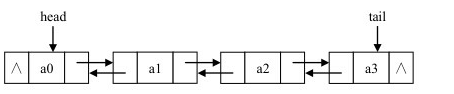
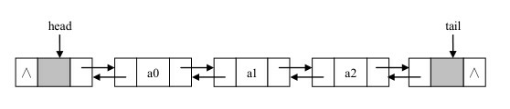

##### 链表

------

1. 链表是一系列存储数据元素的单元通过指针串接起来形成的，因此每个单元至少有两个域，一个域用于数据元素的存储，一个或两个域用于指向其他单元的指针。所以具有一个数据域和多个指针域的存储单元通常称为节点（Node）。

2. 链表的第一个节点和最后一个节点，分别称为链表的头结点和尾结点。尾结点的next引用为空（null）。链表中的每个节点的next相当于一个指针，指向另一个节点，用这些next，可以从头结点移动到尾结点。

3. 链表主要包括单向链表、双向链表和循环链表。

   - 单向链表

     每个节点只有一个指针域

     

     

     - 在单向链表中，每一个节点的数据域都是通过一个object类的对象的引用来指向数据元素的，所以它与数组类似，它的节点也具有**线性次序**，也就是说只能通过a1指向a2，不能通过a2指向a1。
     - 特点：数据元素的存储对应的是不连续的存储空间，每一个存储结点对应一个需要存储的数据元素。每个节点是由数据域和指针域组成，
     - 缺点：
       1. 查找节点时要比顺序存储慢
       2. 比顺序存储的存储密度小，因为每个节点由两部分组成
     - 优点：
       1. 插入和删除比较灵活，不需要移动节点，只需要改变节点中指针走向，但需要先定位到元素上。
       2. 只有有元素的时候才会分配结点空间，不会有闲置的结点。

   - 双向链表

     - 如果在单向链表中想要找到某个节点的前驱节点，必须要从链表的头结点出发依次往后找，需要0(n)的时间，所以就有了双向链表，在单向链表节点结构中新增了一个域，该域用于指向节点的直接前驱节点。他可以从两个方向进行遍历。

       

       

     - 在使用双向链表时 我们一般使用带两个哑元节点的双向链表来实现链表。其中一个为头节点，一个为尾节点，他们都不用来存放数据元素，头节点的pre为空，尾节点的next为空。

       

     - 在具有头尾节点的双向链表中插入或删除节点，无论位置在何处，因为头尾的存在，插入和删除操作都可以被认为是某中间节点的插入删除。并且整个链表永远不会为空。

   - 循环链表

     - 头节点和尾节点被连接在一起的链表称为循环链表

4. 设计链表包含两个类，一个是用Node类来表示节点，另一个是LinKedList类提供插入、删除节点等操作

   - **Node类**(element保存数据，next指向下一个节点)

     > ```jsx
     > //节点
     > function Node(element) {
     >     this.element = element;   //当前节点的元素
     >     this.next = null;         //下一个节点链接
     > }
     > ```

   -  **LinkedList类** (只有一个属性，使用node对象来保存该链表的头节点)

     > ```kotlin
     > //链表类
     > function List () {
     >     this.head = new Node( 'head' );     //头节点
     >     this.find = find;                   //查找节点
     >     this.insert = insert;               //插入节点
     >     this.remove = remove;               //删除节点
     >     this.findPrev = findPrev;           //查找前一个节点
     >     this.display = display;             //显示链表
     > }
     > ```

     head节点的next属性初始化为null，有新元素插入，指向新元素

5. 

   

   